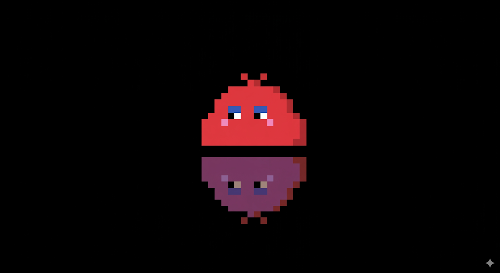

# hatch-clawmate-skill

[](./LICENSE.txt)
[](../../tree/master)
[](./SKILL.md)




`hatch-clawmate` creates Codex-compatible animated pet spritesheets from a text idea or image reference.

<a href="https://apps.microsoft.com/detail/9NJH9X9KDG5P?hl=en-us&gl=IL&ocid=pdpshare">
  
</a>

[](https://apps.microsoft.com/detail/9NJH9X9KDG5P?hl=en-us&gl=IL&ocid=pdpshare)

## What This Is

- A Codex skill you can install locally.
- A tool for generating and packaging animated digital pets.
- A repo you can keep updated with `git pull`.

## Fastest Install For Humans

If you use Codex on Windows, this is the easiest path:

1. Install Git if you do not already have it.
2. Open PowerShell.
3. Copy and run the block below.
4. Restart Codex after it finishes.

```powershell
git clone git@github.com:JacobTheJacobs/hatch-clawmate-skill.git `
  "$HOME\Documents\Playground\hatch-clawmate-skill"

$repo = "$HOME\Documents\Playground\hatch-clawmate-skill"
$codexHome = if ($env:CODEX_HOME) { $env:CODEX_HOME } else { "$HOME\.codex" }

$targets = @(
  "$HOME\.agents\skills\hatch-clawmate",
  "$codexHome\skills\hatch-clawmate"
)

foreach ($target in $targets) {
  if (Test-Path -LiteralPath $target) {
    Remove-Item -LiteralPath $target -Recurse -Force
  }
  New-Item -ItemType Junction -Path $target -Target $repo | Out-Null
}

Write-Host ""
Write-Host "Installed hatch-clawmate."
Write-Host "Repo: $repo"
Write-Host "Restart Codex to load the skill."
```

## Even Easier Agent Install

If you do not want to run commands yourself, paste this into Codex:

```text
Install the GitHub repo `git@github.com:JacobTheJacobs/hatch-clawmate-skill.git` as my local Codex skill `hatch-clawmate`.

Use this repo path:
`$HOME\Documents\Playground\hatch-clawmate-skill`

Requirements:
- Clone the repo if it is missing.
- If it already exists, update it.
- Install the skill into both:
  - `$HOME\.agents\skills\hatch-clawmate`
  - `$HOME\.codex\skills\hatch-clawmate`
- Use junctions or symlinks that point back to the repo.
- Remove any older broken install before creating the new link.
- When done, tell me the final repo path, branch, and latest commit.
```

## Troubleshooting

- If `git` is not recognized, install Git first and reopen PowerShell.
- If Codex does not see the skill, restart Codex.
- If install paths already exist and are broken, rerun the install block above.

## License

Licensed under [MIT](./LICENSE.txt).
